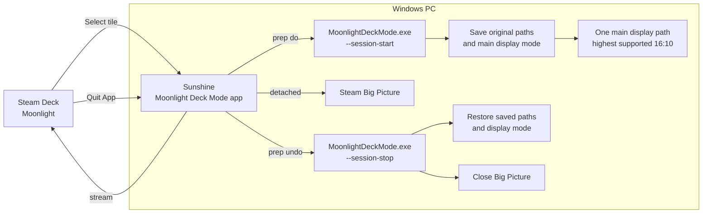

# Moonlight Deck Mode

A one-file Windows installer that adds a **Moonlight Deck Mode** tile to Sunshine. Selecting the tile in Moonlight temporarily keeps only the current main display, sets its highest advertised 16:10 resolution at **1280×800 or above**, and opens Steam Big Picture. **Quit App** restores the display layout and resolution that were present when the session started and closes Big Picture.

The project uses Sunshine's normal application preparation and cleanup commands. It does not patch Sunshine or depend on a fixed Sunshine version.

## Install

1. Download **MoonlightDeckMode.exe** from [Releases](https://github.com/ConnorIrvine/moonlight-steam-deck-mode/releases).
2. Run the executable on the Windows PC. It checks the main display, Steam, and Sunshine, then asks before installing. Approve the Windows administrator prompt so it can update Sunshine's app list.
3. Refresh Moonlight's app list and select **Moonlight Deck Mode**. When finished, use Moonlight's **Quit App** command. A normal disconnect leaves the session available to reconnect.

The installer copies itself and the tile art to `%ProgramData%\MoonlightDeckMode`, backs up Sunshine's `apps.json` there, and adds or updates only its own app entry. It restarts the Sunshine service if that service is running. If Sunshine runs another way, restart it manually. Steam, Sunshine, and their existing apps are not replaced.

The executable is unsigned; Windows may show a SmartScreen warning. You can inspect the source and build it yourself with `build.ps1`.

## Requirements and detection

- Windows 10 or 11 with a main display advertising an exact **16:10** mode of at least **1280×800**. The highest resolution wins; at the same resolution the current refresh rate is preferred.
- Steam installed with its `steam://` URL handler registered.
- Sunshine installed with a readable `apps.json`. Standard Windows locations are detected. For a custom location, pass `--apps-file "C:\path\to\apps.json"` to the installer.
- Moonlight paired with Sunshine. One active monitor or an extended desktop with multiple monitors works. Clone mode is rejected if Windows cannot identify one unique main display path.

`MoonlightDeckMode.exe --check` reports the detected setup without changing any files, displays, or applications. `--dry-run` does the same. If multiple Sunshine app lists are found, the installer stops and asks for an explicit `--apps-file` path. If the main monitor has no qualifying mode, installation stops before making changes.

## Architecture



The session saves its starting state in `%LocalAppData%\MoonlightDeckMode\session.json`. If only one display path was active at the start, it changes only the resolution and restores that resolution on exit. If several distinct paths were active, it temporarily keeps the current main path and restores the saved set on exit. Already being in a one-screen layout is safe. A repeated start for an already active session is harmless; a missing saved state makes stop leave the display alone.

If a monitor is unplugged or the main display changes during a session, automatic restoration can fail. The state file remains so `--session-stop` can be retried after reconnecting the monitor. Windows Display Settings can also restore the layout manually.

## Commands

| Command | Effect |
| --- | --- |
| `MoonlightDeckMode.exe --check` | Read-only prerequisite and mode report |
| `MoonlightDeckMode.exe --install` | Confirm, elevate, and install the Sunshine tile |
| `MoonlightDeckMode.exe --apps-file PATH` | Use a nonstandard Sunshine app list |
| `%ProgramData%\MoonlightDeckMode\MoonlightDeckMode.exe --session-stop` | Retry restoring a saved session |

The installer creates a separate **Moonlight Deck Mode** entry. It leaves an existing **Steam Deck** entry from earlier versions of this repository untouched. Remove that older entry through Sunshine's UI when you no longer use it.

## Development and release

The new application is `deckmode.py` plus the pure decisions in `deckmode_core.py`. `display_toggle.py` supplies Win32 structures and API bindings; the older scripts remain in this branch so an existing installation that points into the checkout keeps working. New installations use only the packaged executable.

Run `py -B -m unittest discover -s tests -v`. To build on Windows, create a virtual environment, install PyInstaller, then run `build.ps1`:

```powershell
py -m venv .venv
.\.venv\Scripts\python.exe -m pip install pyinstaller==6.22.3
.\build.ps1
```

The output is `dist\MoonlightDeckMode.exe`. The build script runs tests and a read-only executable smoke test. The release binary is a PyInstaller one-file console executable with the Moonlight cover image embedded. Only that `.exe` is needed by end users.

The old `Steam Deck Mode.cmd`, `Desktop Mode.cmd`, `moonlight_session.py`, `install_sunshine_app.py`, and `apply_sunshine_app.ps1` are kept for existing installations. New users should use the release executable.
