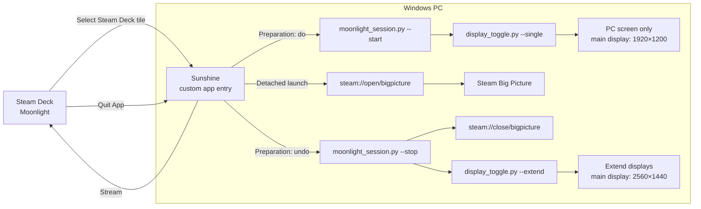

# Moonlight Steam Deck mode for Windows

A small Windows setup that makes a PC ready for a Steam Deck Moonlight session. The **Steam Deck** tile in Sunshine switches the PC to one 1920×1200 display and opens Steam Big Picture. Moonlight's **Quit App** action closes Big Picture and restores the extended desktop, with the main display at 2560×1440.

The setup uses Sunshine's application commands and Steam's URI handler. It does not modify the Sunshine executable or require a particular Sunshine version.

## Architecture



Disconnecting from the stream leaves Sunshine's app session running so Moonlight can reconnect. **Quit App** ends the session and runs the cleanup command.

## Requirements

- Windows PC with Sunshine, Steam, and Python 3 plus the `py` launcher.
- Moonlight on the Steam Deck, already paired with Sunshine.
- A main display that supports both 1920×1200 and 2560×1440. Configure your preferred extended layout in Windows Display Settings first.

The scripts use only Python's standard library. On this PC, Windows' **PC screen only** projection mode keeps the main monitor. Check which monitor that mode selects on other hardware before relying on it remotely.

## Install

1. Clone the repository to a stable path. Sunshine stores absolute paths to the scripts and cover image; moving the folder later requires rerunning the installer.
2. In the project folder, inspect the display state and the planned switch:

   ```powershell
   py display_toggle.py --status
   py display_toggle.py --single --dry-run
   py display_toggle.py --extend --dry-run
   ```

3. Test **Steam Deck Mode.cmd** and **Desktop Mode.cmd** locally. You can make desktop shortcuts to these launchers and use `icons/SteamDeck.ico` and `icons/Windows.ico` for their icons.
4. Open PowerShell as administrator in the project folder and run:

   ```powershell
   .\apply_sunshine_app.ps1
   ```

   This adds or updates a separate **Steam Deck** app in Sunshine, backs up the existing app list in this folder, and restarts the Sunshine service. Other Sunshine apps are preserved.
5. Refresh Moonlight's app list on the Steam Deck and select **Steam Deck**. Use **Quit App** from Moonlight when finished.

For a non-default Sunshine app list, run `py install_sunshine_app.py --apps-file <path>` from an administrator shell and reload Sunshine. `py install_sunshine_app.py --dry-run` shows the entry without changing anything.

## Manual controls

| Command | Result |
| --- | --- |
| `py display_toggle.py --status` | Show Windows display state. |
| `py display_toggle.py --single` | PC screen only, main display at 1920×1200. |
| `py display_toggle.py --extend` | Extend displays, main display at 2560×1440. |
| `py display_toggle.py` | Toggle according to the current display count. |

`moonlight_session.py` is called by Sunshine: `--start` prepares the display, while `--stop` requests normal Steam mode and restores the desktop. Sunshine launches Big Picture separately as a detached command, allowing the stream to remain active until **Quit App**.

## Maintenance

The Sunshine integration is a regular app entry in `apps.json`. Updating Sunshine does not require freezing its version or patching its files. If an update replaces the app list, rerun `apply_sunshine_app.ps1`; the installer updates the named entry without duplicating it. The generated `apps.backup.*.json` files and logs are local and excluded from Git.

`make_icons.py` regenerates the desktop shortcut icons. `make_moonlight_art.ps1` regenerates the 600×800 Moonlight cover image.
